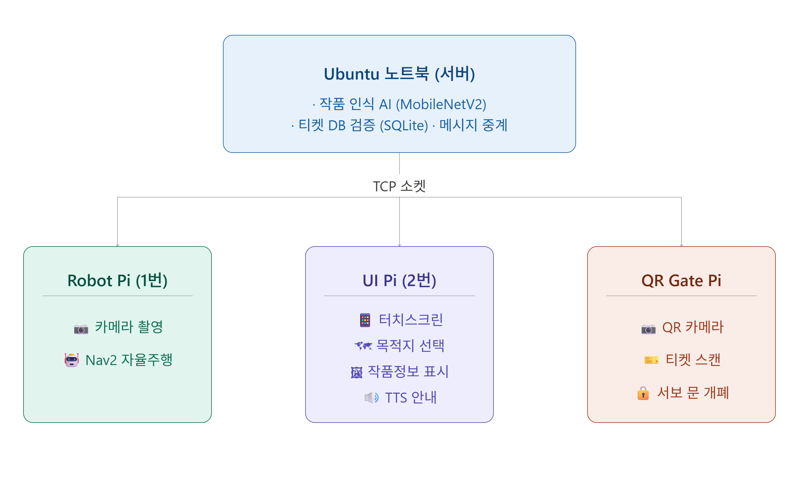

# 🏛️ 미술관 안내 로봇 시스템

**ROS 2 기반 자율주행 로봇이 관람객의 입장부터 퇴장까지 전 과정을 안내하는 통합 시스템입니다.**

QR 티켓으로 입장하면 로봇이 원하는 전시관까지 직접 안내하고, 가까이 다가가면 작품을 자동으로 인식해 음성으로 설명합니다.

<br>

## 🎬 관람객 경험 흐름

```
[입구]                [이동]               [전시관]             [퇴장]

🎫 QR 스캔      →    🗺️ 목적지 선택   →   🖼️ 작품 자동 인식  →  🚪 출입구 안내
티켓 인증             터치스크린 UI         MobileNetV2          QR 재인증
서보 문 개폐          Nav2 자율주행         TTS 음성 설명

```

<br>

## 🖥️ 시스템 구성

이 시스템은 **Raspberry Pi 4** 3대와 **Ubuntu 노트북** 1대로 구성됩니다.



<br>

## ✨ 기능 상세

### 🎫 1단계 — QR 티켓 인증

관람객은 미리 발급된 QR 코드를 입구 리더기에 제시합니다.

- `issue_ticket.py`로 UUID 기반 티켓을 발급하고 QR 이미지를 생성
- 입구 Pi의 카메라가 QR을 스캔 → 서버로 티켓 ID 전송
- 서버가 SQLite DB에서 유효성 확인 (미사용 티켓만 통과, 중복 사용 차단)
- 인증 성공 시: 서보 모터로 게이트 열림 + 터치스크린에 입장 완료 표시

```
관람객 QR 제시 → OpenCV 스캔 → TCP 전송 → DB 검증 → 서보 열림(3초) → 서보 닫힘
```

---

### 🗺️ 2단계 — 목적지 선택 & 자율주행 안내

터치스크린에서 가고 싶은 곳을 고르면 로봇이 스스로 길을 찾아 이동합니다.

| 목적지 | 좌표 (맵 기준) |
|--------|--------------|
| 전시관 A | (1.35, 0.16) |
| 전시관 B | (2.75, -0.27) |
| 전시관 C | (1.42, -0.75) |
| 화장실   | (0.50, -0.80) |
| 출입구   | (0.0, 0.0) |

- ROS 2 **Nav2** 액션 클라이언트가 목적지 좌표로 Goal을 발행
- 도착 시 서버에 `ARRIVED:목적지명` 전송 → UI 자동 전환
- 전시관 도착 시 작품 인식 모드로 전환, 그 외 도착 시 TTS 안내

---

### 🖼️ 3단계 — 딥러닝 작품 자동 인식

전시관에 도착하면 카메라가 작품을 보고 자동으로 설명합니다.

**인식 파이프라인:**
```
카메라 촬영 (424×240, 30fps)
    ↓ 10프레임마다
JPEG 압축 → 서버 전송
    ↓
MobileNetV2 특징 추출 (1280차원 벡터)
    ↓
작품 DB와 코사인 유사도 비교
    ↓
최근 5프레임 다수결 → 최종 결과 확정
    ↓
터치스크린 표시 + TTS 음성 안내
```

**등록된 작품:**
- 진주 귀걸이 소녀 (페르메이르, 1665)
- 그랑드 자트 (쇠라, 1884~1886)
- 세잔 정물화 (폴 세잔, 1895~1900)

> 유사도 0.58 미만이면 "없음"으로 처리하여 오인식 방지

---

### 📱 터치스크린 UI 구조

5개 화면이 상황에 따라 자동으로 전환됩니다.

```
[QR 인증] → [대기 화면] → [목적지 선택] → [이동 중] → [작품 안내]
   ↑                                          ↓ 출입구 도착
   └──────────────── QR 재인증 ───────────────┘
```

- 각 화면에 **긴급 정지** 버튼 배치
- 화면 전환 시 진행 중인 TTS 즉시 중단
- gTTS로 한국어 음성 파일 생성 → mpg123으로 재생

<br>

## 🔌 기기 간 통신 구조

모든 기기는 TCP 소켓으로 서버(`server.py`)를 중심으로 연결됩니다.

```
포트   방향                      내용
────────────────────────────────────────────────────
9999   Robot Pi → 서버          카메라 프레임 + 거리값
9998   서버 → UI Pi             작품 정보 (작가/연도/설명 등)
9997   UI Pi ↔ 서버             목적지 전송 / 도착 알림 수신
9996   서버 ↔ Robot Pi          Nav2 Goal 명령 중계
9995   QR Pi ↔ 서버             티켓 ID 전송 / AUTH 결과 수신
9994   서버 → UI Pi             QR 인증 결과 (AUTH_OK / AUTH_FAIL)
```

<br>

## 🛠️ 기술 스택

| 분류 | 사용 기술 |
|------|----------|
| **언어** | C++17, Python 3 |
| **로봇** | ROS 2 Humble, Nav2, TF2 |
| **AI / 비전** | PyTorch, MobileNetV2, OpenCV 4 |
| **UI** | Qt 5 (QWidget, QTcpSocket, QProcess) |
| **DB** | SQLite 3 |
| **하드웨어** | Raspberry Pi 4 ×3, 카메라, MG996R 서보, lgpio |
| **TTS** | gTTS, mpg123 |

<br>

## 📁 파일 구조

```
├── 🖥️  서버
│   ├── server.py               # 중앙 허브 서버 (모든 포트 관리)
│   ├── database.py             # 티켓 DB 입출력
│   └── issue_ticket.py         # 티켓 발급 도구
│
├── 🤖  Robot Pi
│   ├── main.cpp                # 카메라 촬영 & 서버 전송
│   └── nav_client.cpp          # ROS 2 Nav2 액션 클라이언트
│
├── 🔒  QR Gate Pi
│   ├── qr_main.cpp             # 메인 루프 (스캔 → 인증 → 서보)
│   ├── qr_scanner.cpp/h        # OpenCV QR 인식
│   └── servo_controller.cpp/h  # lgpio 서보 제어
│
└── 📱  UI Pi (Qt)
    ├── mainwindow.cpp/h        # 페이지 라우터
    ├── navigationmanager.cpp/h # 서버 통신 관리
    ├── qrpage.cpp/h            # QR 인증 화면
    ├── standbypage.cpp/h       # 대기 화면
    ├── destinationpage.cpp/h   # 목적지 선택 화면
    ├── navigatingpage.cpp/h    # 이동 중 화면
    └── artworkpage.cpp/h       # 작품 안내 화면
```

<br>

## 🚀 실행 방법

### 사전 설치

```bash
# Python (서버)
pip install torch torchvision opencv-python pillow qrcode gtts

# ROS 2 패키지 (Robot Pi)
sudo apt install ros-humble-nav2-msgs ros-humble-tf2-ros
```

### 실행 순서

```bash
# 1. 서버 먼저 시작 (Ubuntu 노트북)
python3 server.py

# 2. 티켓 발급 (필요 시)
python3 issue_ticket.py
# → tickets/{uuid}.png 생성

# 3. QR Gate Pi
./qr_gate

# 4. Robot Pi
./robot_main                          # 카메라 촬영
ros2 run nav_client nav_client_node   # Nav2 클라이언트 (별도 터미널)

# 5. UI Pi
./museum_ui
```

<br>

## 💡 구현 시 고민했던 점

**작품 인식 오류 줄이기**
카메라 영상은 흔들리기 때문에 단일 프레임 결과를 바로 쓰면 화면이 깜빡입니다. 최근 5프레임의 인식 결과를 모아 가장 많이 나온 값을 채택(Majority Vote)하는 방식으로 안정화했습니다.

**서버 한 대로 여러 기기 동시 처리**
기기마다 포트를 분리하고 각 연결을 독립 스레드로 처리했습니다. 덕분에 QR 인증과 작품 인식, 네비게이션이 서로 블로킹 없이 동시에 동작합니다.

**TTS 끊김 없이 화면 전환**
Qt에서 `gTTS`로 음성 파일을 생성하고 `mpg123`으로 재생하는 방식이라 화면 전환 시 이전 음성이 겹치는 문제가 있었습니다. `showPage()` 호출 시 모든 페이지의 TTS 프로세스를 즉시 `kill()`하고 새 화면의 음성만 재생하도록 처리했습니다.

<br>


